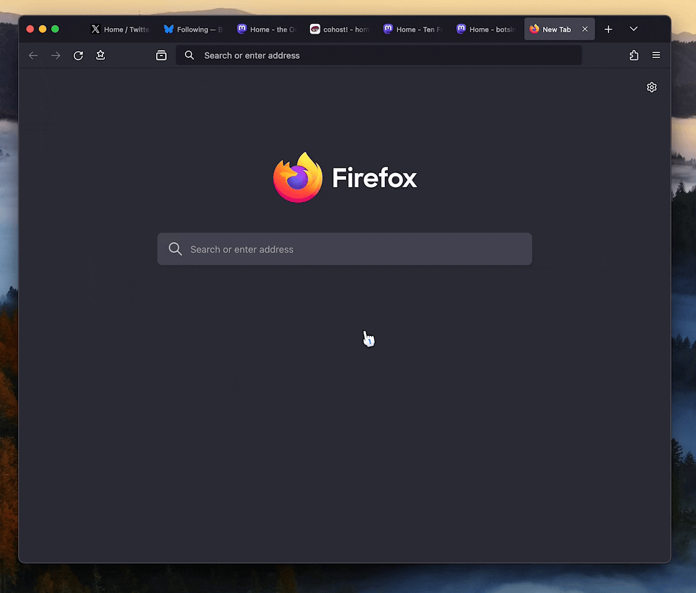
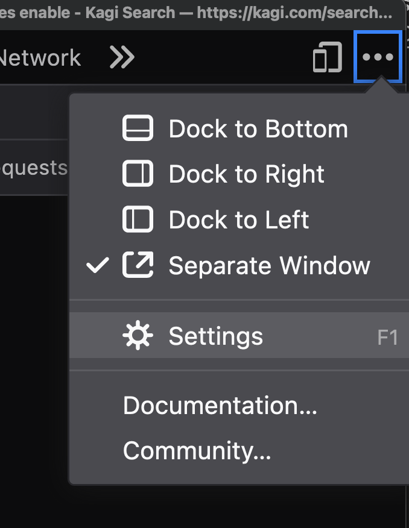
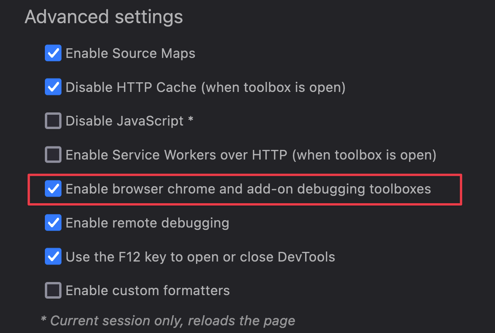
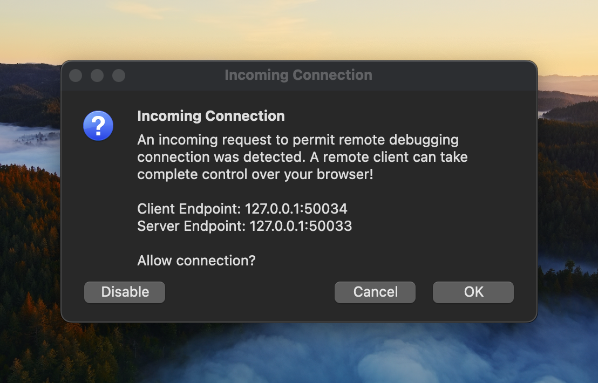
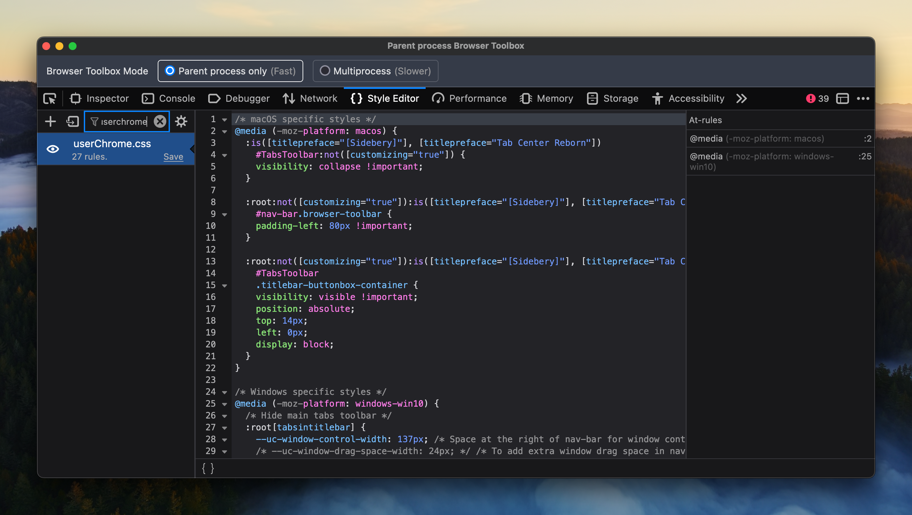
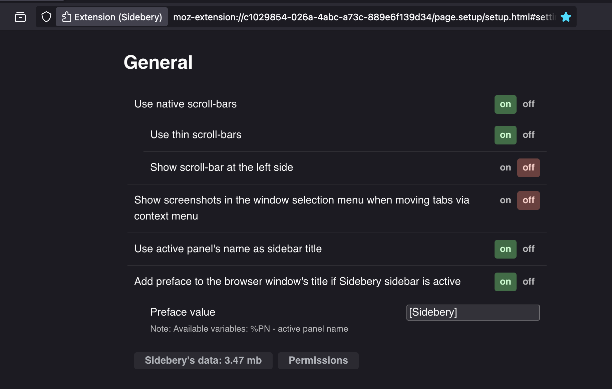
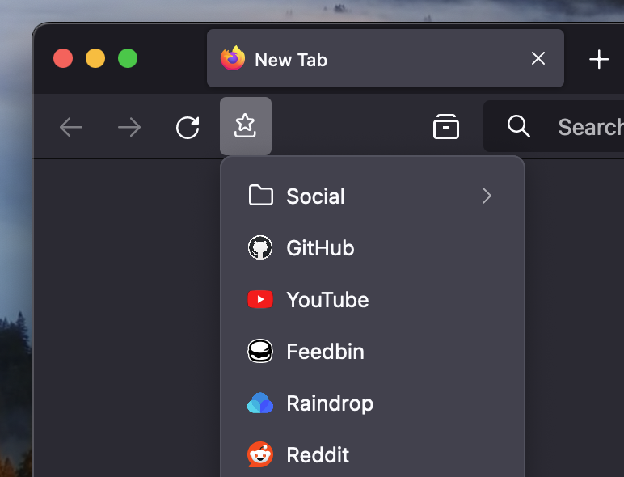
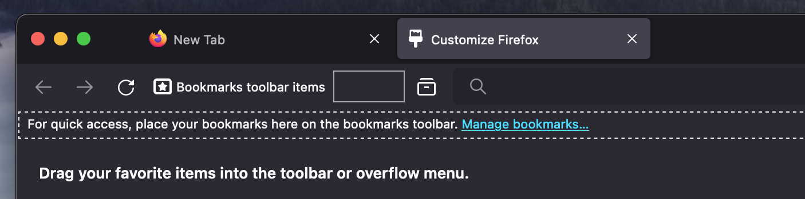

# Firefox "On-Demand" Vertical Tabs

A Firefox setup to have "on-demand" vertical tabs using Sidebery and custom CSS.

Here's a demo, with the vertical tabs (Sidebery) being activated using a keyboard shortcut:

# Installation

Compatibility notes, as of May 19th 2024:

- macOS, Firefox 126

## Pre-setup

First of all, you will need to enable `toolkit.legacyUserProfileCustomizations.stylesheets` in Firefox's `about:config` page.

## CSS Installation

1. Open `about:support`
2. Look for "Profile Folder" and open that folder
3. Create a `chrome` directory if it's not already present
4. Copy the [`userChrome.css`](./userChrome.css) file from this repository into that folder.

### Post-install tinkering (optional)

1. Open the Developer Tools by pressing F12
2. Look for the three dots menu at the top right of the window, open it and go to the Settings

3. Check `Enable browser chrome and add-on debugging toolboxes`

4. You can close the Developer Tools now!
5. Press <kbd>Shift+Alt+Command+I</kbd> on macOS or <kbd>Shift+Alt+Control+I</kbd> on Windows
6. Click OK on the dialog that appears

7. A Developer Tools window will appear, this one is special because it's debugging Firefox's actual UI. Open the `Style Editor` tab inside of it, and use the search bar on the left to look for `userChrome.css`

8. From there, you can edit the CSS and see the changes apply in real-time in Firefox's UI.

## Sidebery

The style by itself won't do much of anything by default. We'll use [Sidebery](https://addons.mozilla.org/en-US/firefox/addon/sidebery/) for the actual vertical tabs functionality, but we will need to set it up a bit to make it work.

1. Install [Sidebery](https://addons.mozilla.org/en-US/firefox/addon/sidebery/)
2. Open its preferences
3. Look for the "Add preface to the browser window's title if Sidebery sidebar is active" preference, enable it and put `[Sidebery]` as the value

4. Now, when Sidebery is open, Firefox's UI will adapt and hide the horizontal tab bar and move the titlebar controls to keep it nice
5. Next, we'll make Sidebery look _slightly_ more native to Firefox's UI, set the following options:

- Color scheme: `auto: dark/light`. If you use a custom Firefox color theme, choose `firefox`
- Theme: `proton`
- Appearance > Density > relaxed (optional)

6. Finally, go to Sidebery's `Styles editor` and paste the content of the [sidebery.css](./sidebery.css) file into it.

## Bonus: one-button bookmarks menu

By default, Firefox's bookmarks bar takes quite a bit of vertical space, this is why I like having a single button to open my bookmarks

The setup is fairly simple:

1. Open the toolbar customization screen and drag the "Bookmark toolbar items" item into the main navigation toolbar, like so:

2. Save your changes, and open the Bookmarks manager (`Bookmarks -> Manage bookmarks`)
3. Go to the Bookmarks Toolbar section and move **all** your bookmarks into a single folder called `★`
4. You're done! The custom CSS will visually replace that folder by Firefox's bookmark icon
